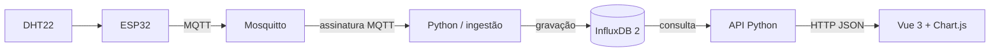

# ArcadeOS

**Keep the game alive.** Plataforma Web IoT para acompanhar temperatura, umidade e disponibilidade de um gabinete de fliperama.

Projeto do **1º bimestre — apresentação em 28/09**. O nome é a identidade do produto: trata-se de uma aplicação Web, não de um sistema operacional.

## Problema e proposta

Em gabinetes fechados, o responsável pelo arcade pode não perceber mudanças na temperatura do ar. O ArcadeOS reúne leituras, histórico e sinalização por limites configuráveis para facilitar esse acompanhamento. O protótipo monitora um gabinete, chamado **Player One**.

O sensor mede o **ar dentro do gabinete**, não CPU/GPU. Os limites de 35 °C e 40 °C são **didáticos** e devem ser ajustados ao equipamento. O sistema não garante prevenção de danos e não controla ventilação nesta etapa.

## Stack obrigatória

| Camada | Implementação |
| --- | --- |
| Interface | Vue 3 + TypeScript + Vite |
| Gráficos | Chart.js |
| Backend | Python + FastAPI |
| Comunicação | MQTT 3.1.1 + Eclipse Mosquitto |
| Dispositivo | ESP32 + DHT22, físico ou no Wokwi |
| Histórico | InfluxDB OSS **2.x**, com Flux |
| Versionamento | Git; publicação no GitHub pelo grupo |

Node.js é usado **somente nas ferramentas do frontend**. O backend é Python. InfluxDB 3 não é uma substituição direta: este projeto usa a API e a linguagem Flux do InfluxDB 2.



## O que está implementado

- Visão geral com temperatura, umidade, pico no período e estado do sensor.
- Gráficos para 1 hora, 6 horas, 24 horas e 7 dias.
- Histórico paginado, filtro por situação térmica e exportação CSV.
- Ficha do hardware, diagnóstico de MQTT/InfluxDB e limites utilizados.
- Firmware com leitura a cada 5 segundos, reconexão e rejeição de leitura inválida.
- Validação no Python e gravação das leituras com horário UTC de recebimento.
- Monitoramento de ausência de dados após 30 segundos.
- Modo de demonstração visual **explicitamente separado** da conexão IoT.
- Simulador MQTT auxiliar para testar os serviços sem depender do dispositivo.

**A demonstração visual não usa o broker nem o banco. O simulador Python usa Mosquitto e InfluxDB, mas não substitui o ESP32/Wokwi exigido pelo professor.**

## Execução rápida: somente o dashboard

Pré-requisitos: Node.js 22.12+ (ou 24 LTS) e pnpm. Se necessário, instale o pnpm com `npm install -g pnpm`.

Na raiz do projeto:

```powershell
pnpm install
pnpm dev
```

Acesse [a demonstração local](http://127.0.0.1:5173/?demo=1). O seletor de cenário permite ensaiar os estados normal, aquecimento, crítico e sem conexão. Não há persistência nesse modo.

### Neste computador, já preparado

As dependências e os serviços portáteis foram preparados na pasta do projeto. Para iniciar todos os serviços e o publicador MQTT auxiliar:

```powershell
.\scripts\start-local.ps1 -Simulate
```

Abra [o ArcadeOS local](http://127.0.0.1:5173). Sem `-Simulate`, o sistema aguarda um dispositivo real ou Wokwi. Os processos rodam em segundo plano, com logs em `.runtime`; o script mantém intactos serviços já ativos nas portas utilizadas.

```powershell
.\scripts\stop-local.ps1
```

Esse comando encerra apenas processos que o inicializador registrou e preserva o banco. O login do InfluxDB local está em `.runtime/local-access.txt`; não compartilhe esse arquivo. Em outro computador, siga a instalação abaixo: `.tools`, `.venv` e `.runtime` não fazem parte do Git.

## Execução completa no Windows

### 1. Mosquitto

Baixe o [Eclipse Mosquitto](https://mosquitto.org/download/) e abra um terminal na raiz do projeto:

```powershell
.\scripts\run-mosquitto.ps1 -Mosquitto 'C:\Program Files\mosquitto\mosquitto.exe'
```

O arquivo `infra/mosquitto.conf` abre **apenas `127.0.0.1:1883`**, sem senha, para desenvolvimento local. Não exponha essa configuração na internet. Ela também não aceita conexões diretas de um ESP32 físico em outro aparelho: nesse caso use a configuração autenticada de rede, descrita em `docs/WOKWI.md`.

Se a cópia portátil em `.tools/mosquitto/mosquitto.exe` estiver presente neste computador, você pode usá-la como argumento do script. As ferramentas portáteis não são versionadas.

### 2. InfluxDB 2

Baixe e extraia o [InfluxDB OSS 2 para Windows](https://docs.influxdata.com/influxdb/v2/install/). Em outro terminal:

```powershell
.\scripts\run-influxdb.ps1 -Influxd 'C:\caminho\influxd.exe'
```

O script mantém os arquivos do banco em `.runtime/influxdb`, ignorados pelo Git, e abre somente `127.0.0.1:8086`.

Abra [o InfluxDB local](http://127.0.0.1:8086) e faça a configuração inicial:

- Organização: `arcadeos`.
- Bucket: `telemetry`, com retenção de pelo menos 30 dias.
- Usuário e senha: escolha valores particulares.
- Gere um token com leitura e escrita no bucket `telemetry`.

Copie `backend/.env.example` para `backend/.env` e preencha `INFLUX_TOKEN`. Não coloque esse token no frontend, firmware, README ou GitHub.

```powershell
Copy-Item backend/.env.example backend/.env
```

**Não execute o comando de cópia se já existir um `.env` configurado.** Preserve suas credenciais.

### 3. Backend Python

Pré-requisito: Python 3.11 ou mais recente; validado com Python 3.12.

```powershell
python -m venv .venv
.\.venv\Scripts\python.exe -m pip install -r backend/requirements.txt
.\scripts\run-backend.ps1
```

A API fica em [127.0.0.1:8000](http://127.0.0.1:8000/docs). Mantenha uma única instância da ingestão: não adicione `--workers` sem separar o consumidor MQTT.

### 4. Frontend

Em outro terminal:

```powershell
pnpm install
pnpm dev
```

Abra [o ArcadeOS](http://127.0.0.1:5173) e selecione **Conexão IoT**. O Vite encaminha `/api` para o backend Python. Não é necessário colocar tokens no navegador.

### 5. ESP32 no Wokwi

Siga [docs/WOKWI.md](docs/WOKWI.md). Os arquivos completos estão em `firmware/arcadeos/`.

O firmware de demonstração usa `test.mosquitto.org`, uma instância pública do Mosquitto, e um tópico exclusivo sem dados pessoais. Configure no `backend/.env`: `MQTT_HOST=test.mosquitto.org`, `MQTT_PORT=1883` e `MQTT_TOPIC=arcadeos/a9f4c2d1/telemetry`. Como alternativa, use **Private Wokwi IoT Gateway** para acessar o Mosquitto local ou um broker remoto próprio protegido por TLS.

### 6. Teste auxiliar antes do ESP32

Com Mosquitto, InfluxDB, Python e frontend ativos:

```powershell
.\.venv\Scripts\python.exe backend/simulate.py --scenario cycle
```

O script publica mensagens MQTT reais, com `source: mqtt-simulator`. O Python grava essas mensagens no InfluxDB e o dashboard consulta o banco. Use `Ctrl+C` para parar; após 30 segundos sem novas leituras, o sensor aparece como offline.

Para publicar somente três leituras críticas:

```powershell
.\.venv\Scripts\python.exe backend/simulate.py --scenario critical --count 3
```

## Alternativa opcional com Docker

Se Docker Desktop já estiver instalado, você pode subir **somente os dois serviços de infraestrutura** com:

```powershell
docker compose -f infra/compose.yaml up -d
```

Faça a configuração do InfluxDB pelo navegador e execute Python e Vue conforme os passos anteriores. Não rode os serviços nativos e os containers nas mesmas portas simultaneamente. Os volumes persistem dados; `docker compose down -v` os apaga e não é necessário para encerrar.

Docker é uma conveniência opcional, não um requisito adicional desta entrega. A aplicação completa ainda não está conteinerizada.

## Contrato de telemetria

Tópico padrão local: `arcadeos/arcade-01/telemetry`. A demonstração Wokwi usa `arcadeos/a9f4c2d1/telemetry` para reduzir colisões no broker compartilhado.

```json
{
  "device_id": "arcade-01",
  "temperature": 28.5,
  "humidity": 47.0,
  "source": "esp32-wokwi"
}
```

Fontes permitidas: `esp32-wokwi`, `esp32-physical`, `mqtt-simulator`. Campos extras, texto no lugar de números, NaN, valores fora da faixa do DHT22, tópico/dispositivo incompatíveis e mensagens retidas recebidas na assinatura são rejeitados.

Publique com `retain=false`. O firmware usa QoS 0 (limite do PubSubClient); o simulador usa QoS 1. O timestamp é atribuído pelo backend ao **receber** a mensagem. Sem conectividade, o ESP32 não acumula um histórico local nem reenvia leituras antigas.

O backend usa uma fila em memória limitada a 500 mensagens. Erros de gravação são contabilizados e exibidos; não existe fila durável ou garantia de entrega durante falhas do banco nesta etapa.

## API

| Endpoint | Retorno |
| --- | --- |
| `GET /api/health` | Processo Python disponível (não comprova broker/banco) |
| `GET /api/status` | Dispositivo, leitura persistida mais recente e diagnóstico |
| `GET /api/history?period=1h` | Histórico e estatísticas do período |
| `GET /docs` | Documentação interativa FastAPI |

Períodos aceitos: `1h`, `6h`, `24h`, `7d`. O gráfico usa médias por janelas de 10s, 1min, 5min e 30min, respectivamente. **Mínima, máxima, média e contagem são calculadas nas leituras brutas**, preservando o pico real do período. A lista de leituras em atenção e o CSV usam a amostragem do gráfico; não constituem um registro completo de alarmes. A leitura atual é consultada separadamente, sem agregação, em uma janela de 30 dias.

O código não publica uma API autenticada na internet: Python, InfluxDB e Vite ficam em loopback por padrão. Para produção, faltam autenticação da aplicação, TLS, gestão de segredos, backups e estratégia de recuperação.

## Verificação

```powershell
pnpm build
.\.venv\Scripts\python.exe -m pip install -r backend/requirements-dev.txt
.\.venv\Scripts\python.exe -m pytest -q
```

Os testes automatizados usam um repositório falso para verificar regras e respostas da API. Não substituem o teste real de MQTT, InfluxDB ou hardware. Consulte [docs/VALIDACAO.md](docs/VALIDACAO.md) para saber exatamente o que foi executado neste ambiente.

O firmware também pode ser compilado localmente com [PlatformIO Core](https://docs.platformio.org/en/latest/core/installation/index.html):

```powershell
pio run
```

O arquivo `platformio.ini` fixa placa, framework e versões das bibliotecas. A saída de compilação em `.pio/` não é versionada.

## Git e GitHub

O `.gitignore` exclui credenciais, banco local, ferramentas baixadas, dependências e builds. Se o repositório ainda não estiver inicializado:

```powershell
git init -b main
git add .
git commit -m "feat: primeira etapa do ArcadeOS"
```

Se necessário, configure seu próprio nome/e-mail no Git. Crie um repositório vazio no GitHub e use **a URL real da sua conta**:

```powershell
git remote add origin https://github.com/SEU_USUARIO/ArcadeOS.git
git push -u origin main
```

Não publique `.env`, `secrets.h` ou dados de `.runtime`. A publicação no GitHub exige acesso à conta do grupo e deve ser confirmada no navegador antes da entrega.

## Organização

```text
src/                  Dashboard Vue + TypeScript + Chart.js
backend/app/          API, regras de validação e ingestão MQTT
backend/tests/        Testes das regras e da API
backend/simulate.py   Publicador MQTT auxiliar
firmware/arcadeos/    ESP32, circuito e bibliotecas do Wokwi
infra/                Mosquitto local/remoto e Docker opcional
scripts/              Inicialização dos serviços no Windows
docs/                 Wokwi, proposta, apresentação e validação
```

## Segundo bimestre

Planejado, **não implementado**: sensores adicionais, controle bidirecional de ventilação/iluminação via MQTT, cadastro de equipamentos e usuários em banco relacional, autenticação e Docker para a aplicação completa.

Referências técnicas: [Vue](https://vuejs.org/guide/introduction.html), [Vite](https://vite.dev/guide/), [Chart.js](https://www.chartjs.org/docs/latest/), [FastAPI](https://fastapi.tiangolo.com/), [Paho MQTT](https://eclipse.dev/paho/files/paho.mqtt.python/html/), [InfluxDB 2](https://docs.influxdata.com/influxdb/v2/), [Mosquitto](https://mosquitto.org/documentation/).
